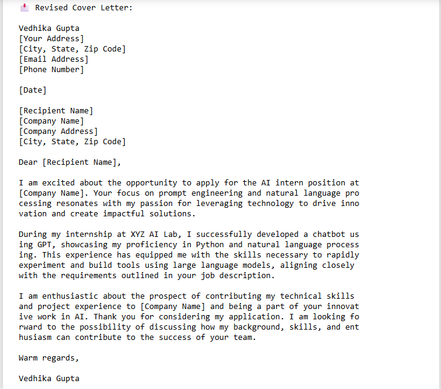
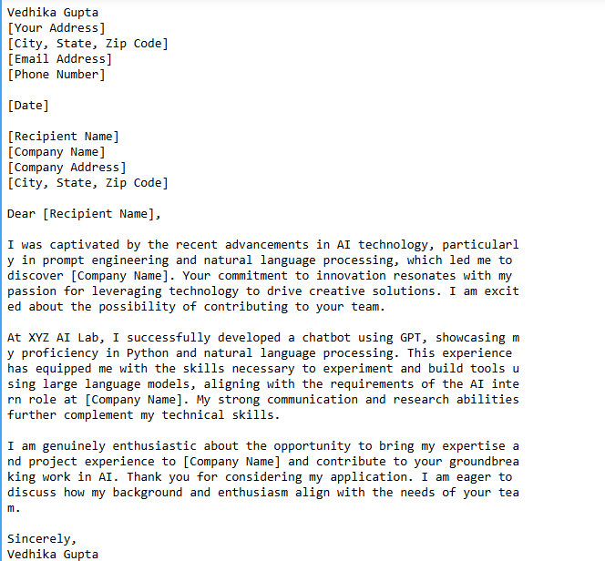

# AI-Powered Cover Letter Generator ✉️🤖

This project uses OpenAI's GPT-3.5-turbo model to generate a formal, personalized cover letter based on a user's resume and job description.

## 🔧 Features
- Uses custom prompt instructions to control tone and structure
- Demonstrates API usage via Python and Colab
- Displays generated output with screenshots (for free-tier usage)

## 🧠 Technologies
- Python
- OpenAI API
- Google Colab

## 📷 Output (Some output images for quick glance)

## 🚀 How to Use
1. Clone the repo or open the notebook in Colab
2. Insert your resume + job description
3. Run the cells and get your custom cover letter!

## 🙋‍♀️ About Me
Made with ❤️ by Yashika Gupta(SE23UCSE190), Engineer student @ Mahindra University as part of my Prompt Engineering learning journey.
